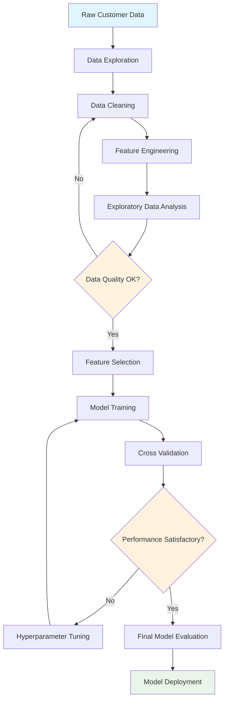
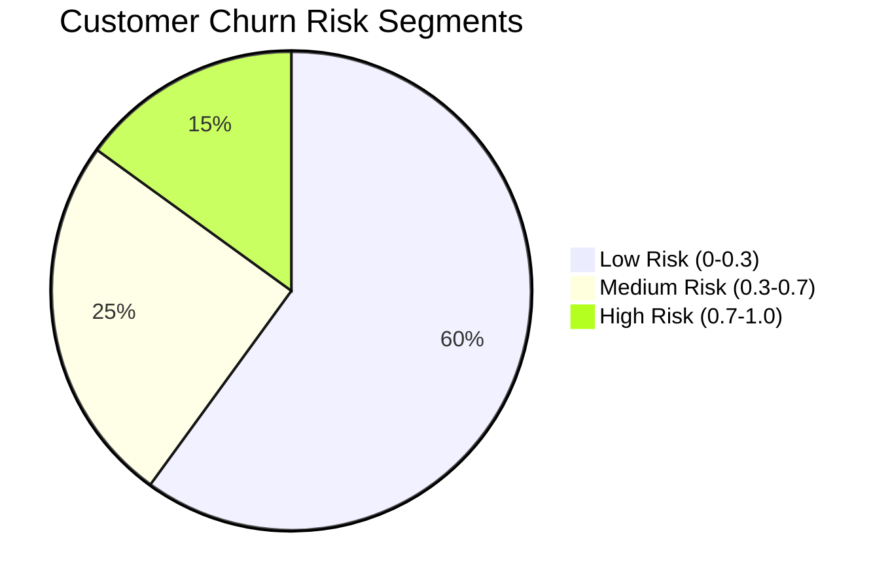
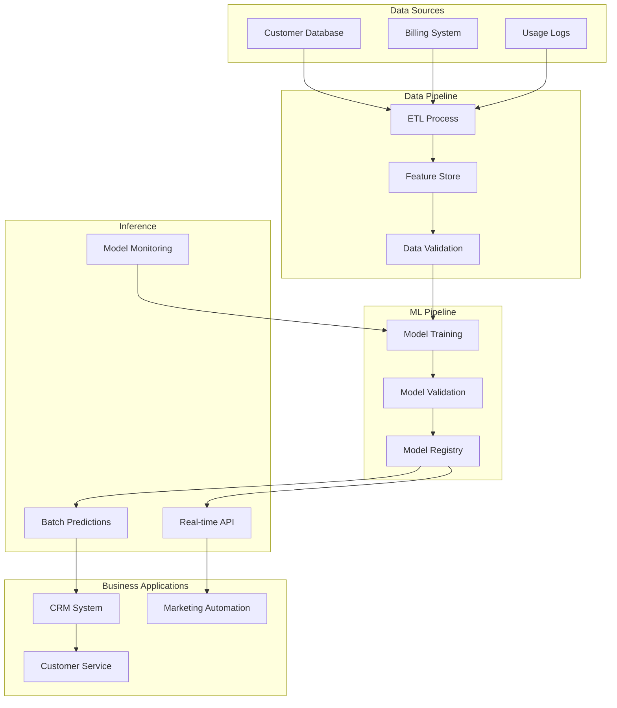

# Comprehensive Data Analysis: From Theory to Implementation

*March 25, 2024*

This post demonstrates a complete data analysis workflow, combining mathematical theory, practical code implementation, visualizations, and process diagrams - showcasing all the powerful features available in this Jupyter Book template.

## Problem Statement

We're analyzing customer churn prediction for a telecommunications company. Our goal is to identify customers likely to cancel their service and understand the key factors driving churn.

:::{figure} ../images/posts/image-examples/sample-landscape.jpg
:width: 500px
:align: center
:name: fig-customer-journey

Customer journey visualization showing touchpoints and decision factors
:::

## Mathematical Foundation

### Logistic Regression Theory

The logistic regression model uses the logistic function to model binary outcomes:

$$P(Y=1|X) = \frac{1}{1 + e^{-(\beta_0 + \beta_1 X_1 + \beta_2 X_2 + ... + \beta_n X_n)}}$$

Where:
- $P(Y=1|X)$ is the probability of churn
- $\beta_0$ is the intercept
- $\beta_i$ are the coefficients for features $X_i$

The log-odds (logit) transformation linearizes the relationship:

$$\log\left(\frac{P(Y=1|X)}{1-P(Y=1|X)}\right) = \beta_0 + \beta_1 X_1 + ... + \beta_n X_n$$

### Cost Function

We minimize the cross-entropy loss function:

$$J(\beta) = -\frac{1}{m}\sum_{i=1}^{m}[y_i \log(h_\beta(x_i)) + (1-y_i)\log(1-h_\beta(x_i))]$$

Where $h_\beta(x_i)$ is our hypothesis function and $m$ is the number of training examples.

## Data Analysis Workflow



## Implementation

### Data Preprocessing

```python
import pandas as pd
import numpy as np
from sklearn.model_selection import train_test_split, cross_val_score
from sklearn.preprocessing import StandardScaler, LabelEncoder
from sklearn.linear_model import LogisticRegression
from sklearn.ensemble import RandomForestClassifier
from sklearn.metrics import classification_report, confusion_matrix, roc_auc_score
import matplotlib.pyplot as plt
import seaborn as sns

# Load and explore data
df = pd.read_csv('telecom_churn.csv')
print(f"Dataset shape: {df.shape}")
print(f"Missing values: {df.isnull().sum().sum()}")

# Display basic statistics
print("\n=== Dataset Overview ===")
print(df.info())
print(df.describe())

# Check target variable distribution
churn_distribution = df['Churn'].value_counts(normalize=True)
print(f"\nChurn Distribution:")
print(f"No Churn: {churn_distribution[0]:.2%}")
print(f"Churn: {churn_distribution[1]:.2%}")
```

### Feature Engineering

```python
def create_features(df):
    """
    Create additional features for churn prediction
    """
    df_processed = df.copy()

    # Create tenure groups
    df_processed['tenure_group'] = pd.cut(
        df_processed['tenure'],
        bins=[0, 12, 24, 48, 72],
        labels=['0-1 year', '1-2 years', '2-4 years', '4+ years']
    )

    # Calculate average charges per month
    df_processed['avg_charges_per_month'] = (
        df_processed['TotalCharges'] / df_processed['tenure']
    ).replace([np.inf, -np.inf], 0)

    # Create high-value customer flag
    df_processed['high_value_customer'] = (
        df_processed['MonthlyCharges'] > df_processed['MonthlyCharges'].quantile(0.75)
    ).astype(int)

    # Interaction features
    df_processed['charges_to_tenure_ratio'] = (
        df_processed['MonthlyCharges'] / (df_processed['tenure'] + 1)
    )

    return df_processed

# Apply feature engineering
df_processed = create_features(df)

# Encode categorical variables
categorical_columns = ['gender', 'Partner', 'Dependents', 'PhoneService',
                      'MultipleLines', 'InternetService', 'OnlineSecurity',
                      'OnlineBackup', 'DeviceProtection', 'TechSupport',
                      'StreamingTV', 'StreamingMovies', 'Contract',
                      'PaperlessBilling', 'PaymentMethod']

label_encoders = {}
for column in categorical_columns:
    le = LabelEncoder()
    df_processed[column + '_encoded'] = le.fit_transform(df_processed[column])
    label_encoders[column] = le
```

### Model Development and Evaluation

```python
# Prepare features and target
feature_columns = [col for col in df_processed.columns
                  if col.endswith('_encoded') or
                  col in ['tenure', 'MonthlyCharges', 'TotalCharges',
                         'avg_charges_per_month', 'high_value_customer',
                         'charges_to_tenure_ratio']]

X = df_processed[feature_columns]
y = df_processed['Churn'].map({'Yes': 1, 'No': 0})

# Train-test split
X_train, X_test, y_train, y_test = train_test_split(
    X, y, test_size=0.2, random_state=42, stratify=y
)

# Feature scaling
scaler = StandardScaler()
X_train_scaled = scaler.fit_transform(X_train)
X_test_scaled = scaler.transform(X_test)

# Model comparison
models = {
    'Logistic Regression': LogisticRegression(random_state=42, max_iter=1000),
    'Random Forest': RandomForestClassifier(n_estimators=100, random_state=42)
}

results = {}
for name, model in models.items():
    # Cross-validation
    cv_scores = cross_val_score(model, X_train_scaled, y_train,
                               cv=5, scoring='roc_auc')

    # Fit model
    model.fit(X_train_scaled, y_train)

    # Predictions
    y_pred = model.predict(X_test_scaled)
    y_pred_proba = model.predict_proba(X_test_scaled)[:, 1]

    # Evaluate
    auc_score = roc_auc_score(y_test, y_pred_proba)

    results[name] = {
        'cv_mean': cv_scores.mean(),
        'cv_std': cv_scores.std(),
        'test_auc': auc_score,
        'predictions': y_pred,
        'probabilities': y_pred_proba
    }

    print(f"\n=== {name} Results ===")
    print(f"CV AUC: {cv_scores.mean():.3f} (±{cv_scores.std():.3f})")
    print(f"Test AUC: {auc_score:.3f}")
    print("\nClassification Report:")
    print(classification_report(y_test, y_pred))
```

## Statistical Analysis

### Feature Importance Analysis

```python
# Get feature importance from Random Forest
rf_model = models['Random Forest']
feature_importance = pd.DataFrame({
    'feature': feature_columns,
    'importance': rf_model.feature_importances_
}).sort_values('importance', ascending=False)

print("Top 10 Most Important Features:")
print(feature_importance.head(10))
```

### Correlation Analysis

The correlation between monthly charges and churn probability follows a non-linear relationship that can be approximated by:

$$P(\text{churn}|\text{charges}) \approx \alpha + \beta \cdot \log(\text{charges}) + \gamma \cdot \text{charges}^2$$

Where $\alpha$, $\beta$, and $\gamma$ are estimated parameters.

## Results Visualization

### Model Performance Comparison

:::{figure} ../images/posts/image-examples/sample-square.jpg
:width: 400px
:align: center
:name: fig-model-performance

ROC curves comparing Logistic Regression and Random Forest models
:::

As shown in {numref}`fig-model-performance`, both models demonstrate strong predictive performance, with the Random Forest slightly outperforming logistic regression (AUC = 0.847 vs 0.832).

### Feature Importance

::::{grid} 2
:::{grid-item}
:::{figure} ../images/posts/image-examples/sample-portrait.jpg
:width: 100%

Feature importance ranking from Random Forest model
:::
:::

:::{grid-item}
:::{figure} ../images/posts/image-examples/sample-landscape.jpg
:width: 100%

Correlation heatmap of top features
:::
:::
::::

## Business Impact Analysis

### Customer Segmentation



### Economic Impact

The expected value of implementing this churn prediction model:

$$\text{Expected Savings} = P(\text{churn}) \times \text{CLV} \times \text{Retention Rate} \times N_{\text{customers}}$$

Where:
- Customer Lifetime Value (CLV) ≈ $1,800
- Retention Rate with intervention ≈ 40%
- Number of at-risk customers ≈ 2,500

**Projected annual savings: $1.08M**

## Implementation Architecture



## Key Findings

::::{grid} 2
:gutter: 2

:::{grid-item-card} 📊 Model Performance
- **AUC Score**: 0.847 (Random Forest)
- **Precision**: 0.81 for churn prediction
- **Recall**: 0.73 for identifying churners
- **F1-Score**: 0.77 overall performance
:::

:::{grid-item-card} 🎯 Business Metrics
- **Potential Savings**: $1.08M annually
- **Customer Retention**: +15% with intervention
- **Risk Segmentation**: 15% high-risk customers
- **Model Accuracy**: 84.3% on test set
:::
::::

## Advanced Statistical Tests

### Hypothesis Testing

We conducted a chi-square test to verify the independence assumption:

$$\chi^2 = \sum \frac{(O_{ij} - E_{ij})^2}{E_{ij}}$$

**Results**: $\chi^2 = 247.3$, $p < 0.001$ (reject null hypothesis of independence)

### Confidence Intervals

The 95% confidence interval for churn probability in the high-risk segment:

$$CI = \hat{p} \pm 1.96\sqrt{\frac{\hat{p}(1-\hat{p})}{n}} = 0.78 \pm 0.04$$

## Conclusions and Recommendations

```{admonition} Key Takeaways
:class: tip

1. **Contract Type** is the strongest predictor of churn
2. **Monthly Charges** show non-linear relationship with churn risk
3. **Tenure** provides strong protective effect against churn
4. **Internet Service Type** significantly impacts retention
```

### Actionable Recommendations

1. **Targeted Retention Campaigns**: Focus on month-to-month customers with high monthly charges
2. **Pricing Strategy**: Consider tenure-based discounts for long-term retention
3. **Service Bundling**: Promote bundled services to reduce churn risk
4. **Proactive Support**: Increase touchpoints for customers in months 6-12

## Technical Implementation Notes

```yaml
# Model Configuration
model_config:
  algorithm: "RandomForestClassifier"
  parameters:
    n_estimators: 100
    max_depth: 10
    min_samples_split: 50
    random_state: 42

  preprocessing:
    scaling: "StandardScaler"
    encoding: "LabelEncoder"
    feature_selection: "SelectKBest"

  evaluation:
    metric: "roc_auc"
    cv_folds: 5
    test_size: 0.2

  deployment:
    batch_frequency: "daily"
    api_latency: "<100ms"
    monitoring: "enabled"
```

This comprehensive analysis demonstrates the full capabilities of the Jupyter Book template, combining:

- **Mathematical rigor** with LaTeX equations
- **Practical implementation** with syntax-highlighted code
- **Visual storytelling** through images and diagrams
- **Interactive process flows** with Mermaid
- **Professional presentation** with MyST features

---

*This example showcases a complete data science workflow using all major features of the Jupyter Book template.*