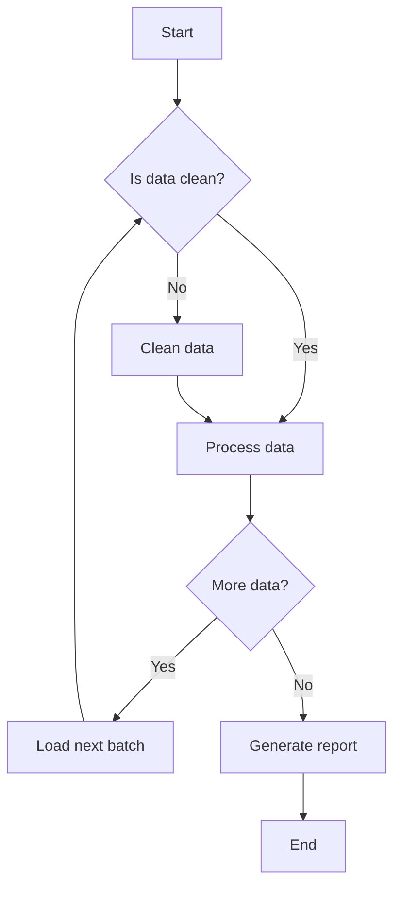
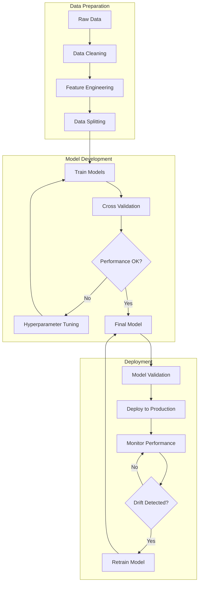
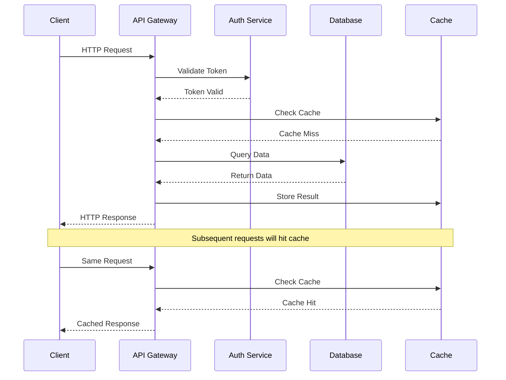
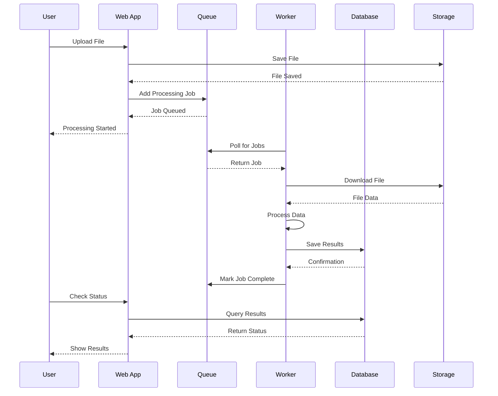
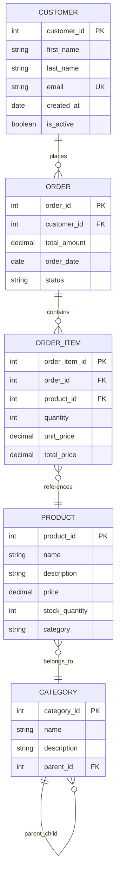
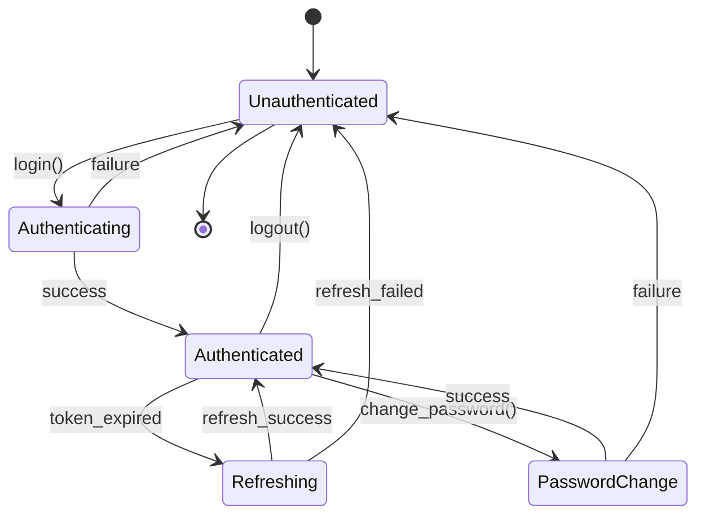
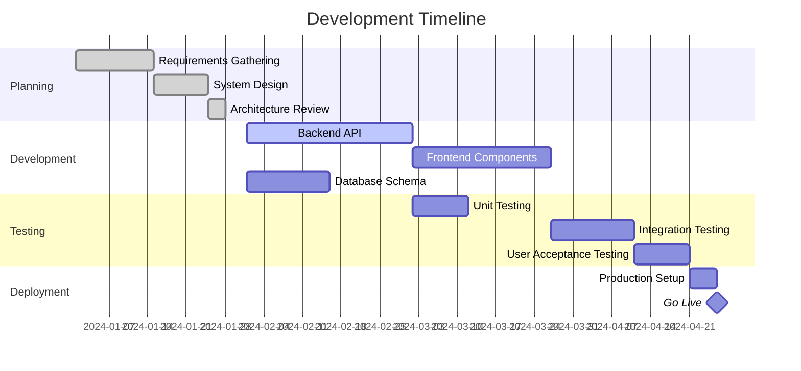
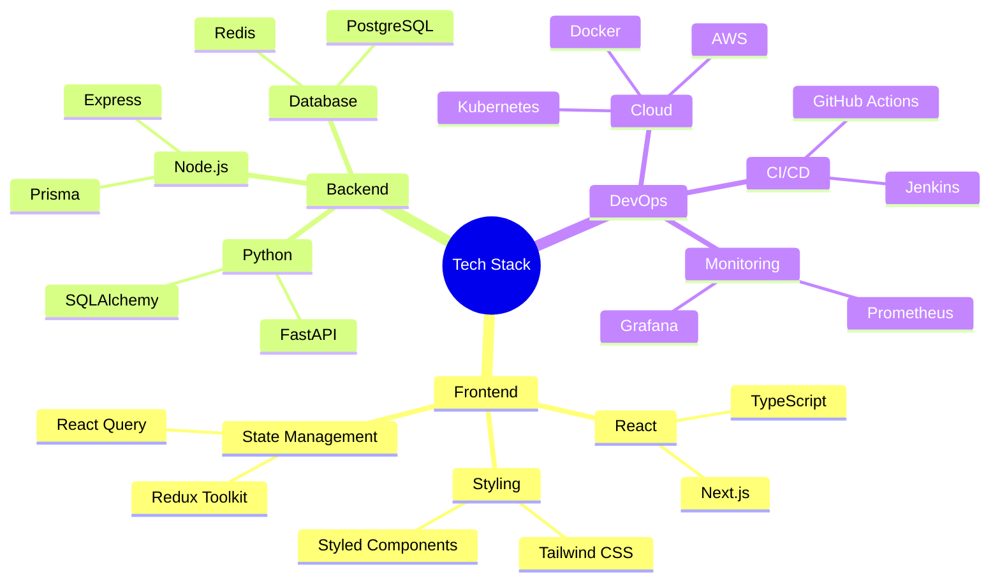
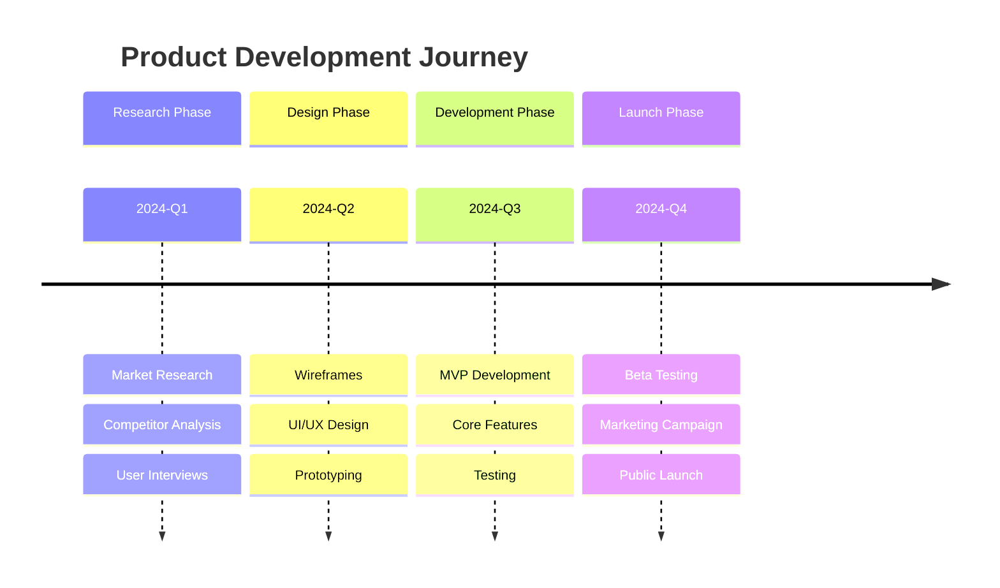

# Interactive Diagrams with Mermaid

This post demonstrates the powerful Mermaid diagram capabilities integrated into this Jupyter Book blog. Mermaid allows you to create interactive flowcharts, sequence diagrams, and more using simple text syntax.

## Flowcharts

### Basic Algorithm Flow



### Machine Learning Pipeline



## Sequence Diagrams

### API Request Flow



### Data Processing Workflow



## Class Diagrams

### Software Architecture

```mermaid
classDiagram
    class User {
        +String username
        +String email
        +Date createdAt
        +login()
        +logout()
        +updateProfile()
    }

    class Article {
        +String title
        +String content
        +Date publishedAt
        +User author
        +publish()
        +edit()
        +delete()
    }

    class Comment {
        +String content
        +Date createdAt
        +User author
        +Article article
        +edit()
        +delete()
    }

    class Tag {
        +String name
        +String description
        +addToArticle()
        +removeFromArticle()
    }

    User ||--o{ Article : creates
    User ||--o{ Comment : writes
    Article ||--o{ Comment : has
    Article }o--o{ Tag : tagged_with
```

## Entity Relationship Diagrams

### Database Schema



## State Diagrams

### User Authentication States



## Git Flow Diagram

### Development Workflow

```mermaid
gitgraph
    commit id: "Initial"
    branch develop
    checkout develop
    commit id: "Setup"

    branch feature/user-auth
    checkout feature/user-auth
    commit id: "Add login"
    commit id: "Add registration"

    checkout develop
    merge feature/user-auth
    commit id: "Merge auth feature"

    branch feature/dashboard
    checkout feature/dashboard
    commit id: "Create dashboard"
    commit id: "Add charts"

    checkout develop
    merge feature/dashboard

    branch release/v1.0
    checkout release/v1.0
    commit id: "Prepare release"
    commit id: "Fix bugs"

    checkout main
    merge release/v1.0
    commit id: "v1.0.0" tag: "v1.0.0"

    checkout develop
    merge release/v1.0
```

## Gantt Charts

### Project Timeline



## Mind Maps

### Technology Stack Overview



## Timeline Diagrams

### Product Development Phases



## Conclusion

Mermaid diagrams provide a powerful way to visualize complex concepts, workflows, and relationships directly within your blog posts. The integration with Jupyter Book makes these diagrams interactive and responsive.

Key benefits:
- **Version Control Friendly**: Diagrams are defined in plain text
- **Interactive**: Hover effects and clickable elements
- **Responsive**: Automatically adapts to different screen sizes
- **Accessible**: Screen reader compatible
- **Maintainable**: Easy to update and modify

For more Mermaid syntax and examples, visit the [official documentation](https://mermaid.js.org/).

---

*This example demonstrates various Mermaid diagram types integrated into Jupyter Book with custom styling.*